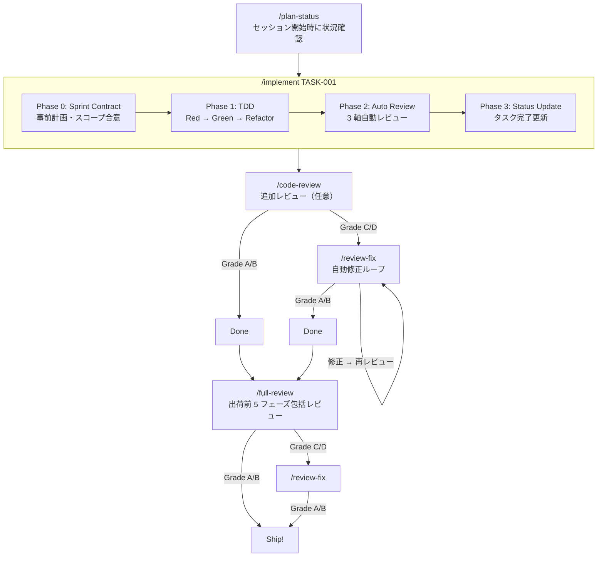

# ai-dev-harness

**Claude Code プラグイン — AI エージェントの品質を構造で担保する**

> **Note:** このリポジトリは個人の開発用プラグインです。自分のプロジェクトで Claude Code を使う際に、品質を担保するためのハーネスを素早く構築する目的で作成・運用しています。

---

## 概要

ai-dev-harness は Claude Code のプラグインとして動作し、以下のワークフローをスキル・エージェントとして提供します:

- **TDD 実装** — Sprint Contract → テスト → 実装 → レビュー → ステータス更新
- **3 軸コードレビュー** — 規約・品質・テストカバレッジの独立レビュアー
- **自動修正ループ** — レビュー → 修正 → 再レビューを Grade A/B まで繰り返し
- **包括レビュー** — 出荷前 5 フェーズの品質チェック
- **計画管理** — タスク・進捗の分析レポート

設計思想は Anthropic ["Claude Code: Best practices for agentic coding"](https://www.anthropic.com/engineering/claude-code-best-practices) に基づいています。

---

## インストール

### 1. クローン

```bash
git clone https://github.com/kinako0626-ota/ai-dev-harness.git ~/ai-dev-harness
```

### 2. プラグインとして起動

```bash
cd your-project
claude --plugin-dir ~/ai-dev-harness
```

初回は `analyze_command`（静的解析コマンド）の入力を求められます。

### 3. プロジェクト初期設定

```
/ai-dev-harness:setup
```

対話形式でプロジェクト情報を収集し、以下を自動生成します:
- `CLAUDE.md` — プロジェクト構成・コマンド・規約マッピング
- `docs/plan/tasks.json` — タスク管理
- `docs/plan/progress.json` — 進捗トラッキング

---

## スキル一覧

| スキル | 説明 | 使い方 |
|--------|------|--------|
| `/ai-dev-harness:setup` | プロジェクト初期設定 | `/ai-dev-harness:setup` |
| `/ai-dev-harness:implement` | 単一タスク TDD 実装 | `/ai-dev-harness:implement TASK-015` |
| `/ai-dev-harness:implement-team` | チーム並列実装 | `/ai-dev-harness:implement-team TASK-015 TASK-016 TASK-017` |
| `/ai-dev-harness:code-review` | 3 軸コードレビュー | `/ai-dev-harness:code-review` |
| `/ai-dev-harness:review-fix` | 自動修正ループ | `/ai-dev-harness:review-fix` |
| `/ai-dev-harness:full-review` | 包括 5 フェーズレビュー | `/ai-dev-harness:full-review` |
| `/ai-dev-harness:plan-status` | 進捗レポート | `/ai-dev-harness:plan-status` |
| `/ai-dev-harness:architecture-check` | アーキテクチャ準拠チェック | `/ai-dev-harness:architecture-check` |

---

## ワークフロー



---

## プロジェクト設定

各プロジェクトの固有設定は `CLAUDE.md` に記述します。`/ai-dev-harness:setup` で自動生成されますが、手動で作成・編集することも可能です。

### CLAUDE.md に記述する項目

| 項目 | 例 |
|------|-----|
| 言語・フレームワーク | `dart / flutter`, `typescript / nextjs` |
| アーキテクチャレイヤー | presentation: `lib/presentation`, domain: `lib/domain` 等 |
| 静的解析コマンド | `fvm flutter analyze`, `npx eslint .` |
| テストコマンド | `fvm flutter test`, `npx jest` |
| タスクIDプレフィックス | `TASK`, `ARC`, `BUG` |
| 自動生成ファイルパターン | `*.g.dart`, `.next/**` |
| 規約マッピング | パス → 規約ファイルの対応表 |
| デザインシステム | クラス名・ファイルパス（任意） |
| i18n 設定 | アクセサ・翻訳ファイル（任意） |

---

## プラグイン構造

```
ai-dev-harness/
├── .claude-plugin/
│   └── plugin.json          # プラグインマニフェスト
├── skills/                  # 8 つのスキル定義
│   ├── setup/               #   プロジェクト初期設定
│   ├── implement/           #   単一タスク TDD 実装
│   ├── implement-team/      #   チーム並列実装
│   ├── code-review/         #   3 軸コードレビュー
│   ├── review-fix/          #   自動修正ループ
│   ├── full-review/         #   包括 5 フェーズレビュー
│   ├── plan-status/         #   進捗レポート
│   └── architecture-check/  #   アーキテクチャ準拠チェック
├── agents/                  # 専門エージェント定義
│   ├── convention-reviewer.md
│   ├── quality-reviewer.md
│   ├── test-coverage-reviewer.md
│   ├── architecture-analyzer.md
│   └── plan-reader.md
├── hooks/
│   └── hooks.json           # git commit 前の自動解析
├── examples/                # スタック別 harness.yaml 例（CLAUDE.md 作成の参考）
└── docs/                    # 設計ドキュメント
```

---

## 設計パターン

Anthropic ["Claude Code: Best practices for agentic coding"](https://www.anthropic.com/engineering/claude-code-best-practices) に基づく:

| パターン | ハーネスでの実装 |
|---------|----------------|
| **Generator-Evaluator 分離** | 実装エージェントとレビューエージェントを分離。3 つの独立レビュアーが並列監査 |
| **Sprint Contract** | `/implement` Phase 0 で完了条件・スコープ外を事前合意してから TDD 開始 |
| **File-based Communication** | レビュー結果を `docs/reviews/` に永続化。セッション跨ぎでも参照可能 |
| **Context Reset Points** | Team 委譲で各エージェントのコンテキストを独立化。蓄積による劣化を防止 |
| **Hard Threshold Gate** | A/B/C/D スコアで合否判定。C/D はマージブロック |
| **Iterative Refinement** | `/review-fix` で最大 5 ラウンドの自動修正ループ |

---

## Credits

- **設計思想**: Anthropic ["Claude Code: Best practices for agentic coding"](https://www.anthropic.com/engineering/claude-code-best-practices)
- **動作環境**: [Claude Code](https://claude.ai/claude-code) (Anthropic)

---

## License

MIT License. See [LICENSE](LICENSE) for details.
